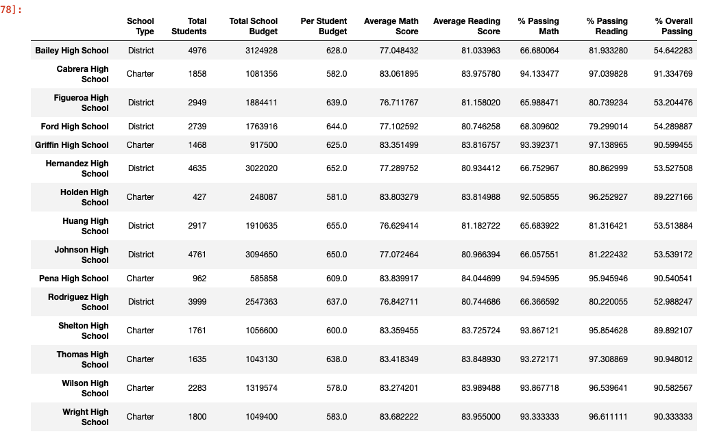
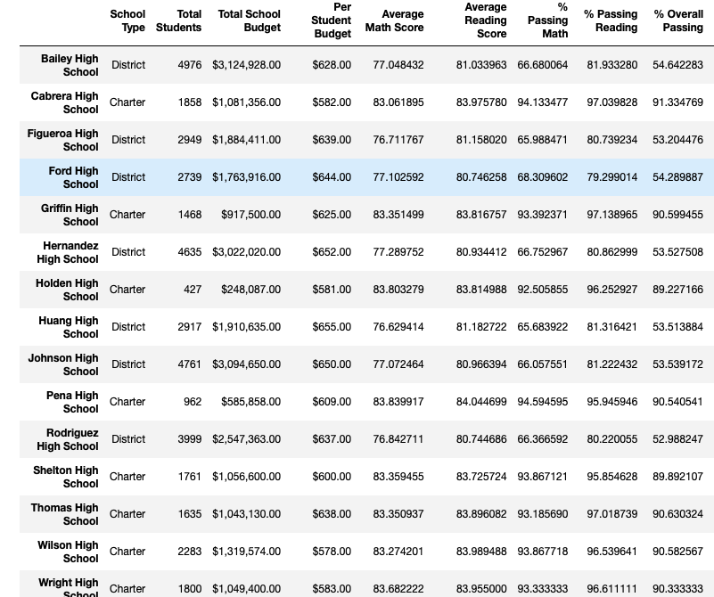

# PyCitySchools-Analysis

## Overview of the Project

### Purpose 

Analyzing the data on student funding and student standardized test scores and showcasing the trends in school performances which will help the School board to make decisions regarding school budgets and priorities.

### Initial Analysis

Using Jupyter notebook, the intial analysis were made based on schools_complete and students_complete datasets. 
Below are the list of deliverables for the initial analysis of the school district: 

A high-level snapshot of the district's key metrics, presented in a table format
An overview of the key metrics for each school, presented in a table format
Tables presenting each of the following metrics:
Top 5 and bottom 5 performing schools, based on the overall passing rate
The average math score received by students in each grade level at each school
The average reading score received by students in each grade level at each school
School performance based on the budget per student
School performance based on the school size 
School performance based on the type of school

[PyCitySchools](PyCitySchools.ipynb) - Initial analysis on School and Student dataset. 

### Updated Analysis 

The purpose of the this analysis is to replace the inaccurate data for the 9th grades at Thomas High school while keeping the rest of the data unchanged and performed the same analysis that were made in our initial analysis.
The metrics that we want to do updated analysis on includes total school budgets, per student capita, average math and reading score, the passing percent for math and reading and the overall passing percentage. 

[PyCitySchools Challenge](PyCitySchools_Challenge.ipynb) - Updated analysis on Student and School dtaset. 

## Result

Most of the metrics from the initial analysis remained the same,we can conclude by saying we had a large dataset and removing a small portion of data (math scores and reading scores for 9th graders at Thomas High School)did not change the original data drastically. 
Below is the metrics from the initial analysis which includes the math scores and reading scores for 9th graders at Thomas high School.

Below metrics is from the updated analysis where the math score and reading scores for 9th graders at Thomas High School was removed. The differences were found only in averages and percentage of passing at Thomas High School. Even after removing certain data,the overall results remains almost similar to the initial analysis.

## Summary 

The 4 major changes occured during the updated analysis is in the number of total students, the number of students counted at Thomas High School,the average math scores and reading scores and the overall percentage for maths cores and reading scores at Thomas High School.By removing the data,there seems to be a decrease in the count of total overall students and total students at Thomas High School. Since the total student count was decreased,this leads to a change in average math and reading scores and percentages. As the changes were minimal,we can assume that the removal of math scores and reading scores for the 9th graders at Thomas High School did not change as significant as we had initially imagined to be. 